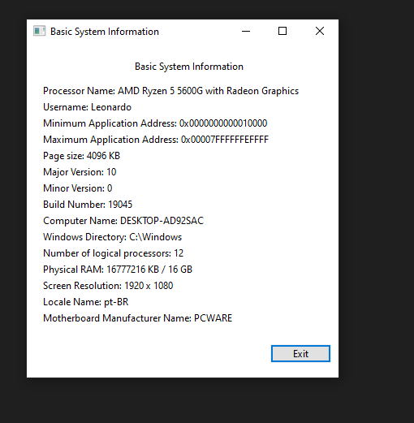

# Windows 10 System Programming

  
  
  
  
  
  

  

## Description
You are in a dedicated repository where I aim to practice various concepts explained by Pavel Yosifovich in his book "Windows 10 System Programming" through several projects developed in C++. This content aims to assist those reading Yosifovich's book or newcomers to Windows programming. While some projects here align with the author's proposals, others are my own creations, designed to simplify and clarify certain concepts (from my perspective). The code presented may not closely resemble the author's, but it's crafted to be as simple and readable as possible. Additionally, you'll find projects entirely developed by me, serving the same explanatory purpose. Use this material as a supplementary resource to better understand both coding practices and Windows-specific concepts.

## How to read the repo
The entire explanation is embedded within the code. My goal is to clarify each segment of the code as lucidly as possible, maintaining a balance between necessary mathematical formalism and cohesiveness to ensure the material is user-friendly. The solution is structured into multiple projects, each encompassing one or more exercises. Navigating to these exercises in the repository is designed to be intuitive. At the beginning of each "main.cpp" or "App.cpp" file, you'll find a rundown of the exercises and concepts addressed in the current project.

## GUI Environment Setup
I use the wxWidgets library to develop GUI-based applications. To run these applications, you must install wxWidgets on your system. Follow the steps below to properly set up wxWidgets:
  1) Download the source code of wxWidgets from https://www.wxwidgets.org/.
  2) Extract the .zip file into a directory of your choice.
  3) Build the wxWidgets project. (Refer to the wxWidgets documentation for detailed instructions.)
  4) Create an environment variable called `WXWIN` pointing to the directory where the files have been extracted.
  5) Done.

## Screenshots
Screenshots of some GUI-based applications developed in the repository.

  
  
  

